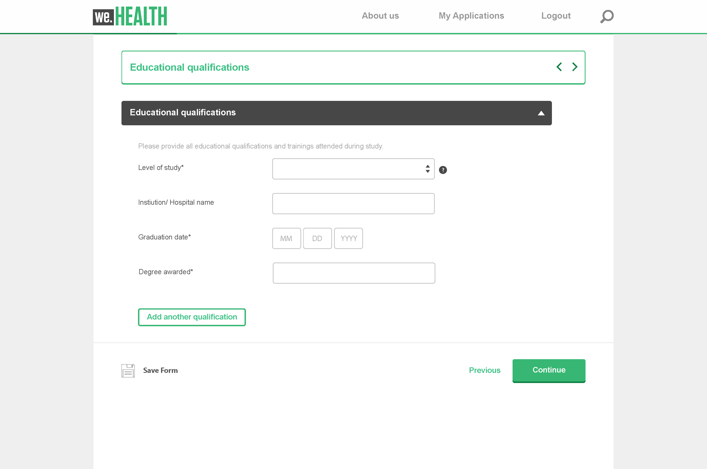

# Introduzione ai componenti core dei moduli adattivi {#adaptive-forms-core-components-introduction}

Utilizzando i componenti core dei moduli adattivi in Adobe Experience Manager, puoi creare esperienze di iscrizione accattivanti utilizzando le opzioni di flessibilità e personalizzazione disponibili.

## Componenti core  {#overview}

In Adobe Experience Manager (AEM), i componenti sono i blocchi predefiniti utilizzati per creare pagine e moduli. Forniscono agli autori un modo semplice e potente per creare e gestire i contenuti, fornendo allo stesso tempo agli sviluppatori la flessibilità e l’estensibilità necessarie per creare componenti personalizzati. Questi sono progettati per velocizzare i tempi di sviluppo e ridurre i costi di manutenzione per siti web e moduli, per essere flessibili e possono essere facilmente personalizzati in base alle esigenze specifiche di un sito web e di un modulo.

I componenti core sono inoltre progettati per essere reattivi e supportano un’ampia gamma di dispositivi, tra cui desktop, tablet e smartphone. Inoltre, rispettano gli standard web e le best practice più recenti, rendendoli una soluzione solida e affidabile per la creazione di contenuti web.

Nel complesso, i componenti core sono uno strumento essenziale per la creazione e la gestione dei contenuti web in AEM, potente e flessibile, che consente di ridurre i tempi di sviluppo e i costi di manutenzione e offire un’ esperienza utente ottimale a coloro che visitano il sito web.

## Componenti core dei moduli adattivi

I componenti core dei moduli adattivi sono un set di 24 componenti open-source compatibili con BEM creati sulle basi dei componenti core di Web Content Management di Adobe Experience Manager. Sono progettati appositamente per la creazione di moduli adattivi, ossia moduli che si adattano al dispositivo, al browser e alle dimensioni dello schermo dell’utente.

Questi componenti possono essere utilizzati per creare esperienze eccezionali di acquisizione e registrazione dei dati fornendo un’ampia gamma di opzioni per i campi modulo, compresi campi di testo, caselle di controllo, menu a discesa e altro ancora. Includono anche funzioni quali convalida, logica condizionale e progettazione reattiva, che possono essere utilizzate per creare moduli intuitivi e facili da usare.

Inoltre, poiché questi componenti sono open-source, gli sviluppatori possono personalizzare ed estendere facilmente i componenti in base alle esigenze specifiche della propria organizzazione. Questi componenti sono inoltre basati sulla metodologia BEM, che garantisce la scalabilità e la manutenzione dei componenti.

## Funzioni {#features}

|  |  |
|---|---|
| Pronti per la produzione | I componenti core dei moduli adattivi sono 24 componenti WCM affidabili. |
| Compatibile con cloud | Disponibile per [AEM Forms as a Cloud Service](https://experienceleague.adobe.com/docs/experience-manager-cloud-service/content/forms/home.html?lang=it). |
| Versatili | I componenti rappresentano concetti generici con i quali gli autori di moduli possono assemblare quasi tutti i layout. |
| Configurabili | I [criteri di contenuto](https://experienceleague.adobe.com/docs/experience-manager-cloud-service/content/implementing/developing/full-stack/components-templates/templates.html?lang=it#content-policies) a livello di modello definiscono quali funzioni sono utilizzabili e quali no. |
| Accessibili | Forniscono etichette ARIA, supportano la navigazione da tastiera e testo per tecnologie di assistenza come le utilità per la lettura dello schermo. |
| Con applicazione tema | I componenti implementano il [sistema di stili](https://experienceleague.adobe.com/docs/experience-manager-cloud-service/content/sites/authoring/features/style-system.html?lang=it) e il markup segue le [convenzioni BEM CSS](https://getbem.com/). |
| Personalizzabili | Diversi modelli consentono una facile personalizzazione, dalla modficia del codice HTML al riutilizzo avanzato delle funzionalità. |
| Controllo delle versioni | I [criteri di controllo delle versioni](https://github.com/adobe/aem-core-wcm-components/wiki/Versioning-policies) garantiscono che i Componenti core non blocchino il tuo sito in fase di miglioramento di elementi che potrebbero influire su di te. |
| Open source | Se qualcosa non va come dovrebbe, suggerisci miglioramenti. |

<!-- comply with [WCAG 2.1 standard](https://www.w3.org/TR/WCAG21/), -->

## Vantaggi {#benefits}

Le esperienze di acquisizione dei dati sono fondamentali per la generazione e la registrazione dei lead e i componenti core dei moduli adattivi offrono una soluzione potente per la creazione di moduli ottimizzati per l’acquisizione dei dati. Alcuni dei motivi per utilizzare i componenti core per creare queste esperienze sui componenti di base sono:

* **Disponibilità su GitHub e documentazione completa**: i componenti core per moduli adattivi in AEM sono open-source e disponibili su GitHub, insieme a una documentazione completa. In questo modo gli sviluppatori possono comprendere più facilmente i componenti e il loro funzionamento e contribuire al loro sviluppo. Anche il sito web [aemcomponents.dev](https://www.aemcomponents.dev/) è una risorsa preziosa, in cui gli sviluppatori possono vedere i componenti in azione e accedere alla documentazione dettagliata.

* **Modello BEM per attribuzione di stile**: i componenti core seguono il modello BEM (Block Element Modifier) per lo stile, una metodologia consolidata e ampiamente utilizzata per l’organizzazione dei CSS. In questo modo gli sviluppatori possono comprendere più facilmente come sono organizzati gli stili e come modificarli in base alle proprie esigenze specifiche.

* **Nessuna dipendenza dalle librerie di terze parti**: uno dei vantaggi dei componenti core è che non hanno dipendenza da librerie JavaScript di terze parti, inclusi JQuery e Underscore. Questo rende i componenti più veloci e leggeri, nonché più facili da integrare in un’implementazione AEM esistente.

* **Focus su prestazioni e accessibilità**: i componenti core sono progettati tenendo presente le prestazioni e l’accessibilità, che si riflettono nei loro punteggi Google Lighthouse e web vitals elevati. Questo rende più facile per gli sviluppatori creare pagine web accessibili e dalle prestazioni elevate, che è sempre più importante nell’attuale panorama digitale.

* **Componenti modulo nel modello e nei temi di Sites 30**: i componenti core supportano i componenti del modulo nel modello e nei temi di Sites 30, facilitando agli sviluppatori la creazione e la personalizzazione dei moduli all’interno di AEM.

* **Stile più semplice**: lo stile dei componenti core è più semplice rispetto a quello delle controparti componenti di base. Il processo di creazione del tema è simile a Sites, con la possibilità di ereditare lo stesso tema/CSS dalla pagina Sites principale. Inoltre, il modello BEM per lo stile facilita la comprensione e la modifica degli stili.

* **Accessibilità**: i componenti core dei moduli adattivi supportano gli standard e le linee guida di accessibilità per garantire che i moduli possano essere utilizzati da persone con disabilità, incluse quelle che utilizzano tecnologie per l’accessibilità, come le utilità per la lettura dello schermo

## Componenti core dei moduli adattivi {#components}

La versione attuale dei componenti core dei moduli adattivi include i componenti elencati in basso.

* [Pannello a soffietto](/help/adaptive-forms/components/accordion.md)
* [Pulsante](/help/adaptive-forms/components/button.md)
* [Gruppo di caselle di selezione](/help/adaptive-forms/components/checkbox-group.md)
* [Selettore data](/help/adaptive-forms/components/date-picker.md)
* [Elenco a discesa](/help/adaptive-forms/components/drop-down.md)
* [Inserimento e-mail](/help/adaptive-forms/components/email-input.md)
* [Contenitore modulo](/help/adaptive-forms/components/form-container.md)
* [Allegato file](/help/adaptive-forms/components/file-attachment.md)
* [Piè di pagina](/help/adaptive-forms/components/footer.md)
* [Intestazione](/help/adaptive-forms/components/header.md)
* [Schede orizzontali](/help/adaptive-forms/components/horizontal-tabs.md)
* [Immagine](/help/adaptive-forms/components/image.md)
* [Inserimento numero](/help/adaptive-forms/components/number-input.md)
* [Contenitore pannelli](/help/adaptive-forms/components/panel-container.md)
* [Pulsante di scelta](/help/adaptive-forms/components/radio-button.md)
* [Pulsante Ripristina](/help/adaptive-forms/components/reset-button.md)
* [Pulsante Invia](/help/adaptive-forms/components/submit-button.md)
* [Inserimento telefono](/help/adaptive-forms/components/telephone-input.md)
* [Inserimento testo](/help/adaptive-forms/components/text-input.md)
* [Testo](/help/adaptive-forms/components/text.md)
* [Titolo](/help/adaptive-forms/components/title.md)
* [Procedura guidata](/help/adaptive-forms/components/wizard.md)

## Configurazione dei componenti core dei moduli adattivi

Abilitando i componenti core dei moduli adattivi su AEM Forms as a Cloud Service, è possibile iniziare a creare, pubblicare e distribuire componenti core basati su moduli adattivi e moduli headless utilizzando le istanze del Cloud Service di AEM Forms su più canali. Per istruzioni dettagliate sull’abilitazione dei componenti core dei moduli adattivi, consulta [Abilita i componenti core dei moduli adattivi nell’ambiente di sviluppo locale di AEM Forms as a Cloud Service](https://experienceleague.adobe.com/docs/experience-manager-cloud-service/content/forms/setup-configure-migrate/enable-adaptive-forms-core-components.html?lang=it).

Di seguito sono riportati i requisiti dei componenti core dei moduli adattivi.

| AEM Versione | Componente aggiuntivo per AEM Forms | Componenti core dei moduli adattivi |
|---|---|---|
| AEM as a Cloud Service | Forms: registrazione digitale | [Versione 2.0.10](version.md)+ |
| AEM 6.5 | Componente aggiuntivo Forms | [Versione 1.1.12](version.md)+ |

Se la versione dell’SDK del Cloud Service di AEM è precedente alla versione 2023.02.0, [assicurati di aver abilitato il flag `prerelease` nel tuo ambiente ](https://experienceleague.adobe.com/docs/experience-manager-cloud-service/content/release-notes/prerelease.html?lang=it#new-features), poiché i componenti core dei moduli adattivi facevano parte della versione prerelease precedente alla versione 2023.02.0.

## Creare componenti core basati sul modulo adattivo

Puoi eseguire le seguenti azioni in entrambi gli ambienti AEM Forms as a Cloud Service o AEM 6.5 Forms:

| Azione | Versione AEM Forms |
|--------|------------------|
| Creare un modulo adattivo indipendente | [AEM Forms as Cloud Service](https://experienceleague.adobe.com/docs/experience-manager-cloud-service/content/forms/adaptive-forms-authoring/authoring-adaptive-forms-core-components/create-an-adaptive-form-on-forms-cs/creating-adaptive-form-core-components.html?lang=it) |
| Creare un modulo adattivo nella pagina AEM Sites | [AEM 6.5 Forms](https://experienceleague.adobe.com/docs/experience-manager-65/forms/adaptive-forms-basic-authoring/create-or-add-an-adaptive-form-to-aem-sites-page.html?lang=it#create-an-adaptive-form-in-sites-editor-or-experience-fragment), [AEM Forms as Cloud Service](https://experienceleague.adobe.com/docs/experience-manager-cloud-service/content/forms/adaptive-forms-authoring/create-or-add-an-adaptive-form-to-aem-sites-page.html?lang=it#create-an-adaptive-form-in-sites-editor-or-experience-fragment) |
| Creare un modulo adattivo in Frammento di esperienza AEM | [AEM 6.5 Forms](https://experienceleague.adobe.com/docs/experience-manager-65/forms/adaptive-forms-basic-authoring/create-or-add-an-adaptive-form-to-aem-sites-page.html?lang=it#create-an-adaptive-form-in-experience-fragment), [AEM Forms as Cloud Service](https://experienceleague.adobe.com/docs/experience-manager-cloud-service/content/forms/adaptive-forms-authoring/create-or-add-an-adaptive-form-to-aem-sites-page.html?lang=it#create-an-adaptive-form-in-experience-fragment) |
| Convertire un modulo adattivo in un Frammento di esperienza | [AEM 6.5 Forms](https://experienceleague.adobe.com/docs/experience-manager-65/forms/adaptive-forms-basic-authoring/create-or-add-an-adaptive-form-to-aem-sites-page.html?lang=it#convert-an-adaptive-form-in-sites-page-to-an-experience-fragment), [AEM Forms as Cloud Service](https://experienceleague.adobe.com/docs/experience-manager-cloud-service/content/forms/adaptive-forms-authoring/create-or-add-an-adaptive-form-to-aem-sites-page.html?lang=it#convert-an-adaptive-form-in-sites-page-to-an-experience-fragment) |

<!-- >, such as  [WCAG 2.1 standard](https://www.w3.org/TR/WCAG21/), to ensure that forms can be used by people with disabilities, including those using assistive technologies such as screen readers.

*   **Alignment with AEM Sites**: The Core Components are designed to be more aligned with AEM Sites, making it easier for Sites users to adopt and use them without having to learn anything new. The components use the same front-end pipeline as Sites, making it easier to style and modify their appearance. 

<!-- Additionally, the following points further illustrate this alignment:

    *   **Authoring experience inline with Page editor**: The Core Components have an authoring experience that is inline with the Sites editor, with dialogs and other experiences similar to the Page editor. This makes it easier for Sites users to create and manage forms within the familiar context of the Sites editor.

    *   **Inline form editing in Sites editor**: The Core Components allow  inline form editing within the Sites editor, avoiding the need to switch back and forth between editors. This streamlines the authoring experience and makes it easier to create and manage forms.

    *   **Inheriting Sites features in Forms**: Forms authored within a Sites page inherit the same features as Sites. This provides a seamless and integrated experience for creating and managing forms within the context of AEM Sites 
    
    <!--including Multi Site Manager, the ability to use Sites components within a form for static content, support for scheduled publish/unpublish, form translation aligned with Sites translation, versioning, and targeting -->

{{see-also}}
