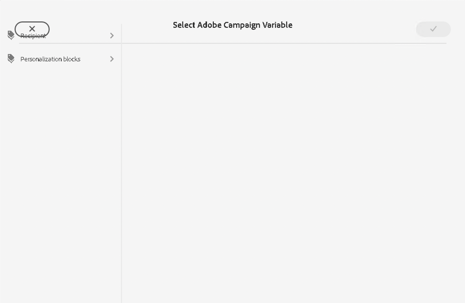
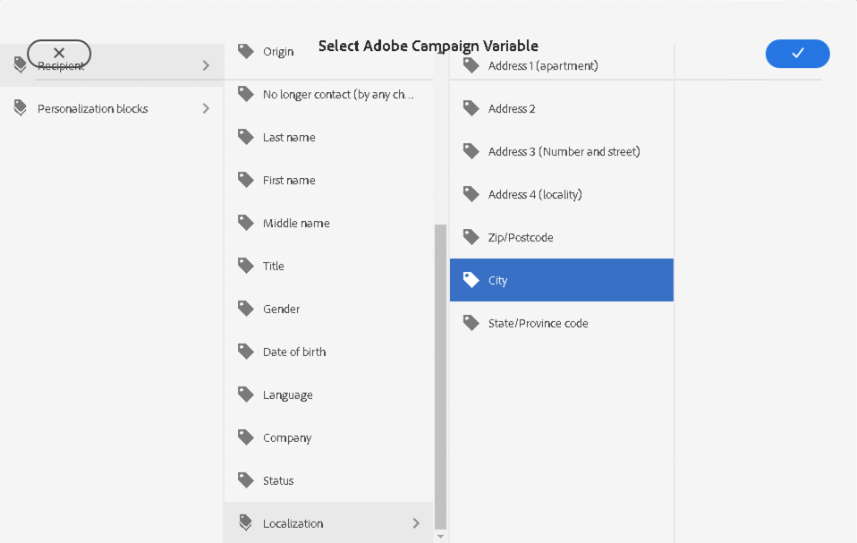
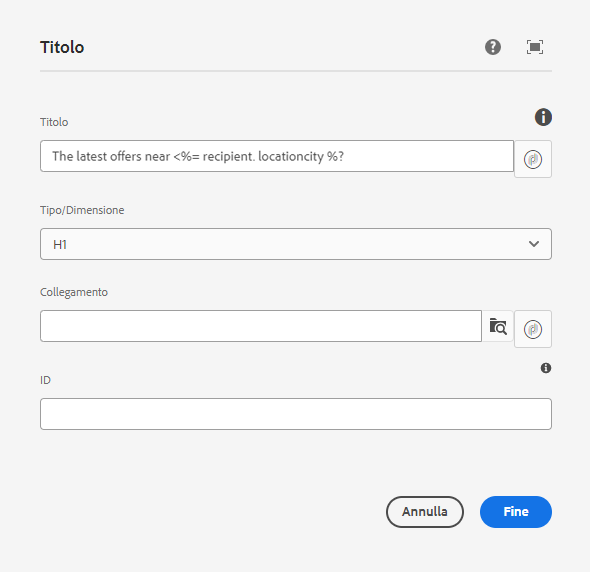

# Variabili di campagna {#campaign-variables}

Utilizza le variabili della campagna per comporre contenuto e-mail personalizzato. Le variabili di Campaign fungono da segnaposto per i valori Adobe Campaign che puoi inserire nel contenuto dell’e-mail. Quando il contenuto viene inviato tramite Adobe Campaign, Campaign sostituisce tali variabili con il contenuto personalizzato del destinatario.

## Utilizzo {#usage}

I componenti core e-mail rendono le variabili delle campagne facilmente accessibili tramite i pulsanti di personalizzazione accanto ai campi di testo comuni. Quando viene premuto, viene visualizzata una finestra di dialogo dalla quale è possibile selezionare un campo di personalizzazione.

L’elenco dei campi di personalizzazione disponibili viene sincronizzato con l’istanza Adobe Campaign. I campi vengono gestiti in Adobe Campaign nello schema `nms:seedMember`. Tutti i campi in `nms:seedMember` deve essere presente anche nella tabella dei destinatari.

## Finestra di dialogo Seleziona variabile Adobe Campaign {#dialog}

La finestra di dialogo Seleziona variabile Adobe Campaign è disponibile in molte finestre di dialogo di modifica dei componenti core e-mail. Per utilizzarlo, fai clic sul pulsante **Seleziona variabile Adobe Campaign** accanto al campo applicabile. Questa icona può assumere due forme.

Fai clic su entrambe le icone per aprire **Seleziona variabile Adobe Campaign** finestra di dialogo.

Utilizza la vista a colonne per individuare la variabile da inserire. Facendo clic su un nodo in una colonna, i relativi elementi secondari vengono visualizzati in una nuova colonna a destra. In questo modo puoi navigare nella struttura del contenuto variabile.

Seleziona la variabile da inserire, quindi fai clic sul segno di spunta in alto a destra nella finestra di dialogo.

La variabile viene quindi inserita nel campo della finestra di dialogo di modifica del componente core e-mail.

Fai clic sulla X in alto a sinistra nella finestra di dialogo in qualsiasi momento per annullare e chiudere la finestra di dialogo.
